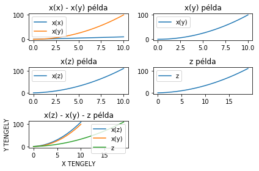

```python
import matplotlib.pyplot as plt
import numpy as np
import pandas as pd

x = np.linspace(0,10,20)
```


```python
plt.plot(x)
```


    [<matplotlib.lines.Line2D at 0x7f175bf91fd0>]


```python
x
```


    array([ 0.        ,  0.52631579,  1.05263158,  1.57894737,  2.10526316,
            2.63157895,  3.15789474,  3.68421053,  4.21052632,  4.73684211,
            5.26315789,  5.78947368,  6.31578947,  6.84210526,  7.36842105,
            7.89473684,  8.42105263,  8.94736842,  9.47368421, 10.        ])


```python
y = x*x
z = x+y
```


```python
y
```


    array([  0.        ,   0.27700831,   1.10803324,   2.49307479,
             4.43213296,   6.92520776,   9.97229917,  13.5734072 ,
            17.72853186,  22.43767313,  27.70083102,  33.51800554,
            39.88919668,  46.81440443,  54.29362881,  62.32686981,
            70.91412742,  80.05540166,  89.75069252, 100.        ])


```python
plt.plot(y)
```


    [<matplotlib.lines.Line2D at 0x7f175bec7050>]


```python
z
```


    array([  0.        ,   0.8033241 ,   2.16066482,   4.07202216,
             6.53739612,   9.5567867 ,  13.13019391,  17.25761773,
            21.93905817,  27.17451524,  32.96398892,  39.30747922,
            46.20498615,  53.6565097 ,  61.66204986,  70.22160665,
            79.33518006,  89.00277008,  99.22437673, 110.        ])


```python
plt.plot(z)
```


    [<matplotlib.lines.Line2D at 0x7f175beb7890>]


```python
plt.plot(x,y)
```


    [<matplotlib.lines.Line2D at 0x7f175be23510>]


```python
plt.plot(x,x,x,y)
plt.plot(x,x, label="x(x)")
plt.plot(x,y, label="x(y)")
plt.legend()
```


    <matplotlib.legend.Legend at 0x7f176655ed50>


```python
plt.subplot(3,2,1)
plt.plot(x,x, label="x(x)")
plt.plot(x,y, label="x(y)")
plt.legend()
plt.title("x(x) - x(y) példa")

plt.subplot(3,2,2)
plt.plot(x,y, label="x(y)")
plt.legend()
plt.title("x(y) példa")

plt.subplot(3,2,3)
plt.plot(x,z, label="x(z)")
plt.legend()
plt.title("x(z) példa")

plt.subplot(3,2,4)
plt.plot(z, label="z")
plt.legend()
plt.title("z példa")

plt.subplot(3,2,5)
plt.plot(x,z, label="x(z)")
plt.plot(x,y, label="x(y)")
plt.plot(z, label="z")
plt.legend()
plt.xlabel("X TENGELY")
plt.ylabel("Y TENGELY")
plt.title("x(z) - x(y) - z példa")

plt.tight_layout()
```





```python
plt.scatter(x,y)
```


    <matplotlib.collections.PathCollection at 0x7f175bb13590>


```python
plt.subplot(1,2,1)
plt.plot(x,y)

plt.subplot(1,2,2)
plt.scatter(x,y)
plt.tight_layout()
```


```python
plt.hist(x,y)
```


    (array([1., 2., 2., 4., 5., 5., 1., 0., 0., 0., 0., 0., 0., 0., 0., 0., 0.,
            0., 0.]),
     array([  0.        ,   0.27700831,   1.10803324,   2.49307479,
              4.43213296,   6.92520776,   9.97229917,  13.5734072 ,
             17.72853186,  22.43767313,  27.70083102,  33.51800554,
             39.88919668,  46.81440443,  54.29362881,  62.32686981,
             70.91412742,  80.05540166,  89.75069252, 100.        ]),
     <a list of 19 Patch objects>)


```python
plt.bar(x,y)
```


    <BarContainer object of 20 artists>


```python
plt.subplot(1,2,1)
plt.hist(x,y)

plt.subplot(1,2,2)
plt.bar(x,y)
plt.tight_layout()
```


```python
plt.fill(x,y)
```


    [<matplotlib.patches.Polygon at 0x7f175b7d4790>]


```python
plt.polar(x,y)
```


    [<matplotlib.lines.Line2D at 0x7f175b8939d0>]


```python
plt.subplot(3,2,1)
plt.hist(x,y)

plt.subplot(3,2,2)
plt.bar(x,y)

plt.subplot(3,2,3)
plt.plot(x,y)

plt.subplot(3,2,4)
plt.scatter(x,y)

plt.subplot(3,2,5)
plt.fill(x,y)

plt.tight_layout()
```


```python
fig =  plt.figure()
x1 = fig.add_axes([0.1,0.1,0.8,0.9])
x2 = fig.add_axes([0.1,0.1,0.3,0.3])
```


```python
fig =  plt.figure()
x1 = fig.add_axes([0.1,0.1,0.8,0.9])
x2 = fig.add_axes([0.3,0.3,0.3,0.9])
```


```python
fig =  plt.figure()
x1 = fig.add_axes([0.1,0.1,0.8,0.9])
x1.set_xlabel("x tengely")
x1.set_ylabel("y tengely")
x1.set_title("CÍM")
x1.plot(x,y, alpha=0.5)

x2 = fig.add_axes([0.9,1,0.3,0.3])
x2.set_xlabel("x tengely2")
x2.set_ylabel("y tengely2")
x2.set_title("CÍM2")
x2.plot(x,z, linestyle=":")
```


    [<matplotlib.lines.Line2D at 0x7f17591c6c10>]


```python
fig, axes = plt.subplots(2,2)
axes[0][0].plot(x,y, linewidth=3)
axes[0][1].plot(x,y, color="orange")
axes[0][1].bar(x,y)
plt.tight_layout()
```


```python
fig, axes = plt.subplots(1,2)
axes[0].set_xlabel("x")
axes[0].set_xlabel("y")
axes[0].set_title("a függvény pontokkal is jelölve")
axes[0].plot(x,y)
axes[0].scatter(x,y)

axes[1].scatter(x,y)
plt.tight_layout()
```


```python
fig = plt.figure(figsize = (10,10))
axes = fig.add_axes([0,0,1,1])
axes.set_xlabel("x tengely")
axes.set_ylabel("y tengely")
axes.set_title("CÍM")
axes.plot(x,y, marker="o", markersize=15, markerfacecolor = "red", markeredgecolor = "black", markeredgewidth = 5)
```


    [<matplotlib.lines.Line2D at 0x7f1758437650>]


```python
fig, axes = plt.subplots(2,1, figsize = (5,10))
axes[0].plot(x,x)
axes[1].plot(y,x)
```


    [<matplotlib.lines.Line2D at 0x7f175a20c110>]


```python
fig = plt.figure()
axes = fig.add_axes([0,0,1,1])
axes.plot(x,y)
axes.set_xlim([0,6])
```


    (0, 6)


```python
fig = plt.figure()
axes = fig.add_axes([0,0,1,1])
axes.plot(x,y)
axes.set_xlim([0,6])
axes.set_ylim([0,40])
```


    (0, 40)


```python

```


```python

```
