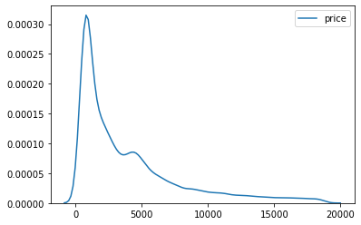
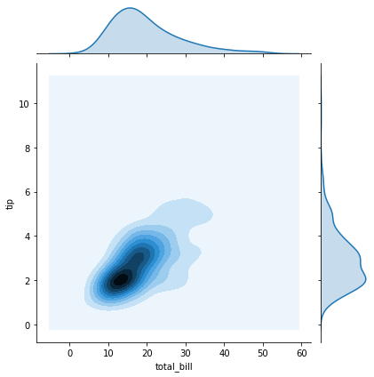

```python
import seaborn as sns
import numpy as np
import pandas as pd
diamond = pd.read_csv('https://raw.githubusercontent.com/mwaskom/seaborn-data/master/diamonds.csv')
diamond
```


<div>
<style scoped>
    .dataframe tbody tr th:only-of-type {
        vertical-align: middle;
    }

    .dataframe tbody tr th {
        vertical-align: top;
    }

    .dataframe thead th {
        text-align: right;
    }
</style>
<table border="1" class="dataframe">
  <thead>
    <tr style="text-align: right;">
      <th></th>
      <th>carat</th>
      <th>cut</th>
      <th>color</th>
      <th>clarity</th>
      <th>depth</th>
      <th>table</th>
      <th>price</th>
      <th>x</th>
      <th>y</th>
      <th>z</th>
    </tr>
  </thead>
  <tbody>
    <tr>
      <th>0</th>
      <td>0.23</td>
      <td>Ideal</td>
      <td>E</td>
      <td>SI2</td>
      <td>61.5</td>
      <td>55.0</td>
      <td>326</td>
      <td>3.95</td>
      <td>3.98</td>
      <td>2.43</td>
    </tr>
    <tr>
      <th>1</th>
      <td>0.21</td>
      <td>Premium</td>
      <td>E</td>
      <td>SI1</td>
      <td>59.8</td>
      <td>61.0</td>
      <td>326</td>
      <td>3.89</td>
      <td>3.84</td>
      <td>2.31</td>
    </tr>
    <tr>
      <th>2</th>
      <td>0.23</td>
      <td>Good</td>
      <td>E</td>
      <td>VS1</td>
      <td>56.9</td>
      <td>65.0</td>
      <td>327</td>
      <td>4.05</td>
      <td>4.07</td>
      <td>2.31</td>
    </tr>
    <tr>
      <th>3</th>
      <td>0.29</td>
      <td>Premium</td>
      <td>I</td>
      <td>VS2</td>
      <td>62.4</td>
      <td>58.0</td>
      <td>334</td>
      <td>4.20</td>
      <td>4.23</td>
      <td>2.63</td>
    </tr>
    <tr>
      <th>4</th>
      <td>0.31</td>
      <td>Good</td>
      <td>J</td>
      <td>SI2</td>
      <td>63.3</td>
      <td>58.0</td>
      <td>335</td>
      <td>4.34</td>
      <td>4.35</td>
      <td>2.75</td>
    </tr>
    <tr>
      <th>5</th>
      <td>0.24</td>
      <td>Very Good</td>
      <td>J</td>
      <td>VVS2</td>
      <td>62.8</td>
      <td>57.0</td>
      <td>336</td>
      <td>3.94</td>
      <td>3.96</td>
      <td>2.48</td>
    </tr>
    <tr>
      <th>6</th>
      <td>0.24</td>
      <td>Very Good</td>
      <td>I</td>
      <td>VVS1</td>
      <td>62.3</td>
      <td>57.0</td>
      <td>336</td>
      <td>3.95</td>
      <td>3.98</td>
      <td>2.47</td>
    </tr>
    <tr>
      <th>7</th>
      <td>0.26</td>
      <td>Very Good</td>
      <td>H</td>
      <td>SI1</td>
      <td>61.9</td>
      <td>55.0</td>
      <td>337</td>
      <td>4.07</td>
      <td>4.11</td>
      <td>2.53</td>
    </tr>
    <tr>
      <th>8</th>
      <td>0.22</td>
      <td>Fair</td>
      <td>E</td>
      <td>VS2</td>
      <td>65.1</td>
      <td>61.0</td>
      <td>337</td>
      <td>3.87</td>
      <td>3.78</td>
      <td>2.49</td>
    </tr>
    <tr>
      <th>9</th>
      <td>0.23</td>
      <td>Very Good</td>
      <td>H</td>
      <td>VS1</td>
      <td>59.4</td>
      <td>61.0</td>
      <td>338</td>
      <td>4.00</td>
      <td>4.05</td>
      <td>2.39</td>
    </tr>
    <tr>
      <th>10</th>
      <td>0.30</td>
      <td>Good</td>
      <td>J</td>
      <td>SI1</td>
      <td>64.0</td>
      <td>55.0</td>
      <td>339</td>
      <td>4.25</td>
      <td>4.28</td>
      <td>2.73</td>
    </tr>
    <tr>
      <th>11</th>
      <td>0.23</td>
      <td>Ideal</td>
      <td>J</td>
      <td>VS1</td>
      <td>62.8</td>
      <td>56.0</td>
      <td>340</td>
      <td>3.93</td>
      <td>3.90</td>
      <td>2.46</td>
    </tr>
    <tr>
      <th>12</th>
      <td>0.22</td>
      <td>Premium</td>
      <td>F</td>
      <td>SI1</td>
      <td>60.4</td>
      <td>61.0</td>
      <td>342</td>
      <td>3.88</td>
      <td>3.84</td>
      <td>2.33</td>
    </tr>
    <tr>
      <th>13</th>
      <td>0.31</td>
      <td>Ideal</td>
      <td>J</td>
      <td>SI2</td>
      <td>62.2</td>
      <td>54.0</td>
      <td>344</td>
      <td>4.35</td>
      <td>4.37</td>
      <td>2.71</td>
    </tr>
    <tr>
      <th>14</th>
      <td>0.20</td>
      <td>Premium</td>
      <td>E</td>
      <td>SI2</td>
      <td>60.2</td>
      <td>62.0</td>
      <td>345</td>
      <td>3.79</td>
      <td>3.75</td>
      <td>2.27</td>
    </tr>
    <tr>
      <th>15</th>
      <td>0.32</td>
      <td>Premium</td>
      <td>E</td>
      <td>I1</td>
      <td>60.9</td>
      <td>58.0</td>
      <td>345</td>
      <td>4.38</td>
      <td>4.42</td>
      <td>2.68</td>
    </tr>
    <tr>
      <th>16</th>
      <td>0.30</td>
      <td>Ideal</td>
      <td>I</td>
      <td>SI2</td>
      <td>62.0</td>
      <td>54.0</td>
      <td>348</td>
      <td>4.31</td>
      <td>4.34</td>
      <td>2.68</td>
    </tr>
    <tr>
      <th>17</th>
      <td>0.30</td>
      <td>Good</td>
      <td>J</td>
      <td>SI1</td>
      <td>63.4</td>
      <td>54.0</td>
      <td>351</td>
      <td>4.23</td>
      <td>4.29</td>
      <td>2.70</td>
    </tr>
    <tr>
      <th>18</th>
      <td>0.30</td>
      <td>Good</td>
      <td>J</td>
      <td>SI1</td>
      <td>63.8</td>
      <td>56.0</td>
      <td>351</td>
      <td>4.23</td>
      <td>4.26</td>
      <td>2.71</td>
    </tr>
    <tr>
      <th>19</th>
      <td>0.30</td>
      <td>Very Good</td>
      <td>J</td>
      <td>SI1</td>
      <td>62.7</td>
      <td>59.0</td>
      <td>351</td>
      <td>4.21</td>
      <td>4.27</td>
      <td>2.66</td>
    </tr>
    <tr>
      <th>20</th>
      <td>0.30</td>
      <td>Good</td>
      <td>I</td>
      <td>SI2</td>
      <td>63.3</td>
      <td>56.0</td>
      <td>351</td>
      <td>4.26</td>
      <td>4.30</td>
      <td>2.71</td>
    </tr>
    <tr>
      <th>21</th>
      <td>0.23</td>
      <td>Very Good</td>
      <td>E</td>
      <td>VS2</td>
      <td>63.8</td>
      <td>55.0</td>
      <td>352</td>
      <td>3.85</td>
      <td>3.92</td>
      <td>2.48</td>
    </tr>
    <tr>
      <th>22</th>
      <td>0.23</td>
      <td>Very Good</td>
      <td>H</td>
      <td>VS1</td>
      <td>61.0</td>
      <td>57.0</td>
      <td>353</td>
      <td>3.94</td>
      <td>3.96</td>
      <td>2.41</td>
    </tr>
    <tr>
      <th>23</th>
      <td>0.31</td>
      <td>Very Good</td>
      <td>J</td>
      <td>SI1</td>
      <td>59.4</td>
      <td>62.0</td>
      <td>353</td>
      <td>4.39</td>
      <td>4.43</td>
      <td>2.62</td>
    </tr>
    <tr>
      <th>24</th>
      <td>0.31</td>
      <td>Very Good</td>
      <td>J</td>
      <td>SI1</td>
      <td>58.1</td>
      <td>62.0</td>
      <td>353</td>
      <td>4.44</td>
      <td>4.47</td>
      <td>2.59</td>
    </tr>
    <tr>
      <th>25</th>
      <td>0.23</td>
      <td>Very Good</td>
      <td>G</td>
      <td>VVS2</td>
      <td>60.4</td>
      <td>58.0</td>
      <td>354</td>
      <td>3.97</td>
      <td>4.01</td>
      <td>2.41</td>
    </tr>
    <tr>
      <th>26</th>
      <td>0.24</td>
      <td>Premium</td>
      <td>I</td>
      <td>VS1</td>
      <td>62.5</td>
      <td>57.0</td>
      <td>355</td>
      <td>3.97</td>
      <td>3.94</td>
      <td>2.47</td>
    </tr>
    <tr>
      <th>27</th>
      <td>0.30</td>
      <td>Very Good</td>
      <td>J</td>
      <td>VS2</td>
      <td>62.2</td>
      <td>57.0</td>
      <td>357</td>
      <td>4.28</td>
      <td>4.30</td>
      <td>2.67</td>
    </tr>
    <tr>
      <th>28</th>
      <td>0.23</td>
      <td>Very Good</td>
      <td>D</td>
      <td>VS2</td>
      <td>60.5</td>
      <td>61.0</td>
      <td>357</td>
      <td>3.96</td>
      <td>3.97</td>
      <td>2.40</td>
    </tr>
    <tr>
      <th>29</th>
      <td>0.23</td>
      <td>Very Good</td>
      <td>F</td>
      <td>VS1</td>
      <td>60.9</td>
      <td>57.0</td>
      <td>357</td>
      <td>3.96</td>
      <td>3.99</td>
      <td>2.42</td>
    </tr>
    <tr>
      <th>...</th>
      <td>...</td>
      <td>...</td>
      <td>...</td>
      <td>...</td>
      <td>...</td>
      <td>...</td>
      <td>...</td>
      <td>...</td>
      <td>...</td>
      <td>...</td>
    </tr>
    <tr>
      <th>53910</th>
      <td>0.70</td>
      <td>Premium</td>
      <td>E</td>
      <td>SI1</td>
      <td>60.5</td>
      <td>58.0</td>
      <td>2753</td>
      <td>5.74</td>
      <td>5.77</td>
      <td>3.48</td>
    </tr>
    <tr>
      <th>53911</th>
      <td>0.57</td>
      <td>Premium</td>
      <td>E</td>
      <td>IF</td>
      <td>59.8</td>
      <td>60.0</td>
      <td>2753</td>
      <td>5.43</td>
      <td>5.38</td>
      <td>3.23</td>
    </tr>
    <tr>
      <th>53912</th>
      <td>0.61</td>
      <td>Premium</td>
      <td>F</td>
      <td>VVS1</td>
      <td>61.8</td>
      <td>59.0</td>
      <td>2753</td>
      <td>5.48</td>
      <td>5.40</td>
      <td>3.36</td>
    </tr>
    <tr>
      <th>53913</th>
      <td>0.80</td>
      <td>Good</td>
      <td>G</td>
      <td>VS2</td>
      <td>64.2</td>
      <td>58.0</td>
      <td>2753</td>
      <td>5.84</td>
      <td>5.81</td>
      <td>3.74</td>
    </tr>
    <tr>
      <th>53914</th>
      <td>0.84</td>
      <td>Good</td>
      <td>I</td>
      <td>VS1</td>
      <td>63.7</td>
      <td>59.0</td>
      <td>2753</td>
      <td>5.94</td>
      <td>5.90</td>
      <td>3.77</td>
    </tr>
    <tr>
      <th>53915</th>
      <td>0.77</td>
      <td>Ideal</td>
      <td>E</td>
      <td>SI2</td>
      <td>62.1</td>
      <td>56.0</td>
      <td>2753</td>
      <td>5.84</td>
      <td>5.86</td>
      <td>3.63</td>
    </tr>
    <tr>
      <th>53916</th>
      <td>0.74</td>
      <td>Good</td>
      <td>D</td>
      <td>SI1</td>
      <td>63.1</td>
      <td>59.0</td>
      <td>2753</td>
      <td>5.71</td>
      <td>5.74</td>
      <td>3.61</td>
    </tr>
    <tr>
      <th>53917</th>
      <td>0.90</td>
      <td>Very Good</td>
      <td>J</td>
      <td>SI1</td>
      <td>63.2</td>
      <td>60.0</td>
      <td>2753</td>
      <td>6.12</td>
      <td>6.09</td>
      <td>3.86</td>
    </tr>
    <tr>
      <th>53918</th>
      <td>0.76</td>
      <td>Premium</td>
      <td>I</td>
      <td>VS1</td>
      <td>59.3</td>
      <td>62.0</td>
      <td>2753</td>
      <td>5.93</td>
      <td>5.85</td>
      <td>3.49</td>
    </tr>
    <tr>
      <th>53919</th>
      <td>0.76</td>
      <td>Ideal</td>
      <td>I</td>
      <td>VVS1</td>
      <td>62.2</td>
      <td>55.0</td>
      <td>2753</td>
      <td>5.89</td>
      <td>5.87</td>
      <td>3.66</td>
    </tr>
    <tr>
      <th>53920</th>
      <td>0.70</td>
      <td>Very Good</td>
      <td>E</td>
      <td>VS2</td>
      <td>62.4</td>
      <td>60.0</td>
      <td>2755</td>
      <td>5.57</td>
      <td>5.61</td>
      <td>3.49</td>
    </tr>
    <tr>
      <th>53921</th>
      <td>0.70</td>
      <td>Very Good</td>
      <td>E</td>
      <td>VS2</td>
      <td>62.8</td>
      <td>60.0</td>
      <td>2755</td>
      <td>5.59</td>
      <td>5.65</td>
      <td>3.53</td>
    </tr>
    <tr>
      <th>53922</th>
      <td>0.70</td>
      <td>Very Good</td>
      <td>D</td>
      <td>VS1</td>
      <td>63.1</td>
      <td>59.0</td>
      <td>2755</td>
      <td>5.67</td>
      <td>5.58</td>
      <td>3.55</td>
    </tr>
    <tr>
      <th>53923</th>
      <td>0.73</td>
      <td>Ideal</td>
      <td>I</td>
      <td>VS2</td>
      <td>61.3</td>
      <td>56.0</td>
      <td>2756</td>
      <td>5.80</td>
      <td>5.84</td>
      <td>3.57</td>
    </tr>
    <tr>
      <th>53924</th>
      <td>0.73</td>
      <td>Ideal</td>
      <td>I</td>
      <td>VS2</td>
      <td>61.6</td>
      <td>55.0</td>
      <td>2756</td>
      <td>5.82</td>
      <td>5.84</td>
      <td>3.59</td>
    </tr>
    <tr>
      <th>53925</th>
      <td>0.79</td>
      <td>Ideal</td>
      <td>I</td>
      <td>SI1</td>
      <td>61.6</td>
      <td>56.0</td>
      <td>2756</td>
      <td>5.95</td>
      <td>5.97</td>
      <td>3.67</td>
    </tr>
    <tr>
      <th>53926</th>
      <td>0.71</td>
      <td>Ideal</td>
      <td>E</td>
      <td>SI1</td>
      <td>61.9</td>
      <td>56.0</td>
      <td>2756</td>
      <td>5.71</td>
      <td>5.73</td>
      <td>3.54</td>
    </tr>
    <tr>
      <th>53927</th>
      <td>0.79</td>
      <td>Good</td>
      <td>F</td>
      <td>SI1</td>
      <td>58.1</td>
      <td>59.0</td>
      <td>2756</td>
      <td>6.06</td>
      <td>6.13</td>
      <td>3.54</td>
    </tr>
    <tr>
      <th>53928</th>
      <td>0.79</td>
      <td>Premium</td>
      <td>E</td>
      <td>SI2</td>
      <td>61.4</td>
      <td>58.0</td>
      <td>2756</td>
      <td>6.03</td>
      <td>5.96</td>
      <td>3.68</td>
    </tr>
    <tr>
      <th>53929</th>
      <td>0.71</td>
      <td>Ideal</td>
      <td>G</td>
      <td>VS1</td>
      <td>61.4</td>
      <td>56.0</td>
      <td>2756</td>
      <td>5.76</td>
      <td>5.73</td>
      <td>3.53</td>
    </tr>
    <tr>
      <th>53930</th>
      <td>0.71</td>
      <td>Premium</td>
      <td>E</td>
      <td>SI1</td>
      <td>60.5</td>
      <td>55.0</td>
      <td>2756</td>
      <td>5.79</td>
      <td>5.74</td>
      <td>3.49</td>
    </tr>
    <tr>
      <th>53931</th>
      <td>0.71</td>
      <td>Premium</td>
      <td>F</td>
      <td>SI1</td>
      <td>59.8</td>
      <td>62.0</td>
      <td>2756</td>
      <td>5.74</td>
      <td>5.73</td>
      <td>3.43</td>
    </tr>
    <tr>
      <th>53932</th>
      <td>0.70</td>
      <td>Very Good</td>
      <td>E</td>
      <td>VS2</td>
      <td>60.5</td>
      <td>59.0</td>
      <td>2757</td>
      <td>5.71</td>
      <td>5.76</td>
      <td>3.47</td>
    </tr>
    <tr>
      <th>53933</th>
      <td>0.70</td>
      <td>Very Good</td>
      <td>E</td>
      <td>VS2</td>
      <td>61.2</td>
      <td>59.0</td>
      <td>2757</td>
      <td>5.69</td>
      <td>5.72</td>
      <td>3.49</td>
    </tr>
    <tr>
      <th>53934</th>
      <td>0.72</td>
      <td>Premium</td>
      <td>D</td>
      <td>SI1</td>
      <td>62.7</td>
      <td>59.0</td>
      <td>2757</td>
      <td>5.69</td>
      <td>5.73</td>
      <td>3.58</td>
    </tr>
    <tr>
      <th>53935</th>
      <td>0.72</td>
      <td>Ideal</td>
      <td>D</td>
      <td>SI1</td>
      <td>60.8</td>
      <td>57.0</td>
      <td>2757</td>
      <td>5.75</td>
      <td>5.76</td>
      <td>3.50</td>
    </tr>
    <tr>
      <th>53936</th>
      <td>0.72</td>
      <td>Good</td>
      <td>D</td>
      <td>SI1</td>
      <td>63.1</td>
      <td>55.0</td>
      <td>2757</td>
      <td>5.69</td>
      <td>5.75</td>
      <td>3.61</td>
    </tr>
    <tr>
      <th>53937</th>
      <td>0.70</td>
      <td>Very Good</td>
      <td>D</td>
      <td>SI1</td>
      <td>62.8</td>
      <td>60.0</td>
      <td>2757</td>
      <td>5.66</td>
      <td>5.68</td>
      <td>3.56</td>
    </tr>
    <tr>
      <th>53938</th>
      <td>0.86</td>
      <td>Premium</td>
      <td>H</td>
      <td>SI2</td>
      <td>61.0</td>
      <td>58.0</td>
      <td>2757</td>
      <td>6.15</td>
      <td>6.12</td>
      <td>3.74</td>
    </tr>
    <tr>
      <th>53939</th>
      <td>0.75</td>
      <td>Ideal</td>
      <td>D</td>
      <td>SI2</td>
      <td>62.2</td>
      <td>55.0</td>
      <td>2757</td>
      <td>5.83</td>
      <td>5.87</td>
      <td>3.64</td>
    </tr>
  </tbody>
</table>
<p>53940 rows × 10 columns</p>
</div>


```python
sns.distplot(diamond['price'])
```


    <matplotlib.axes._subplots.AxesSubplot at 0x7f9e3ac042d0>


```python
sns.distplot(diamond['price'], kde = False)
```


    <matplotlib.axes._subplots.AxesSubplot at 0x7f9e39da1f90>


```python
sns.rugplot(diamond['x'])
```


    <matplotlib.axes._subplots.AxesSubplot at 0x7f9e39caa490>


```python
sns.kdeplot(diamond['price'])
```


    <matplotlib.axes._subplots.AxesSubplot at 0x7f9e35d31110>





```python
tips = pd.read_csv('https://raw.githubusercontent.com/mwaskom/seaborn-data/master/tips.csv')
tips.head()
```


<div>
<style scoped>
    .dataframe tbody tr th:only-of-type {
        vertical-align: middle;
    }

    .dataframe tbody tr th {
        vertical-align: top;
    }

    .dataframe thead th {
        text-align: right;
    }
</style>
<table border="1" class="dataframe">
  <thead>
    <tr style="text-align: right;">
      <th></th>
      <th>total_bill</th>
      <th>tip</th>
      <th>sex</th>
      <th>smoker</th>
      <th>day</th>
      <th>time</th>
      <th>size</th>
    </tr>
  </thead>
  <tbody>
    <tr>
      <th>0</th>
      <td>16.99</td>
      <td>1.01</td>
      <td>Female</td>
      <td>No</td>
      <td>Sun</td>
      <td>Dinner</td>
      <td>2</td>
    </tr>
    <tr>
      <th>1</th>
      <td>10.34</td>
      <td>1.66</td>
      <td>Male</td>
      <td>No</td>
      <td>Sun</td>
      <td>Dinner</td>
      <td>3</td>
    </tr>
    <tr>
      <th>2</th>
      <td>21.01</td>
      <td>3.50</td>
      <td>Male</td>
      <td>No</td>
      <td>Sun</td>
      <td>Dinner</td>
      <td>3</td>
    </tr>
    <tr>
      <th>3</th>
      <td>23.68</td>
      <td>3.31</td>
      <td>Male</td>
      <td>No</td>
      <td>Sun</td>
      <td>Dinner</td>
      <td>2</td>
    </tr>
    <tr>
      <th>4</th>
      <td>24.59</td>
      <td>3.61</td>
      <td>Female</td>
      <td>No</td>
      <td>Sun</td>
      <td>Dinner</td>
      <td>4</td>
    </tr>
  </tbody>
</table>
</div>


```python
sns.residplot(x='total_bill', y ='tip', data=tips, lowess=True)
```


    <matplotlib.axes._subplots.AxesSubplot at 0x7f9e35cb6390>


```python
sns.jointplot(x='total_bill', y ='tip', data=tips)
```


    <seaborn.axisgrid.JointGrid at 0x7f9e3ac53a50>


```python
sns.jointplot(x='total_bill', y ='tip', data=tips, kind='scatter')
```


    <seaborn.axisgrid.JointGrid at 0x7f9e35b58e90>


```python
sns.jointplot(x='total_bill', y ='tip', data=tips, kind='kde')
```


    <seaborn.axisgrid.JointGrid at 0x7f9e359e1bd0>





```python
sns.jointplot(x='total_bill', y ='tip', data=tips, kind='hex', color='#ffac12')
```


    <seaborn.axisgrid.JointGrid at 0x7f9e35cbde50>


```python
sns.jointplot(x='total_bill', y ='tip', data=tips, kind='reg', color='#171614')
```


    <seaborn.axisgrid.JointGrid at 0x7f9e3583e710>


```python
dots = pd.read_csv('https://raw.githubusercontent.com/mwaskom/seaborn-data/master/dots.csv')
dots.head()
```


<div>
<style scoped>
    .dataframe tbody tr th:only-of-type {
        vertical-align: middle;
    }

    .dataframe tbody tr th {
        vertical-align: top;
    }

    .dataframe thead th {
        text-align: right;
    }
</style>
<table border="1" class="dataframe">
  <thead>
    <tr style="text-align: right;">
      <th></th>
      <th>align</th>
      <th>choice</th>
      <th>time</th>
      <th>coherence</th>
      <th>firing_rate</th>
    </tr>
  </thead>
  <tbody>
    <tr>
      <th>0</th>
      <td>dots</td>
      <td>T1</td>
      <td>-80</td>
      <td>0.0</td>
      <td>33.189967</td>
    </tr>
    <tr>
      <th>1</th>
      <td>dots</td>
      <td>T1</td>
      <td>-80</td>
      <td>3.2</td>
      <td>31.691726</td>
    </tr>
    <tr>
      <th>2</th>
      <td>dots</td>
      <td>T1</td>
      <td>-80</td>
      <td>6.4</td>
      <td>34.279840</td>
    </tr>
    <tr>
      <th>3</th>
      <td>dots</td>
      <td>T1</td>
      <td>-80</td>
      <td>12.8</td>
      <td>32.631874</td>
    </tr>
    <tr>
      <th>4</th>
      <td>dots</td>
      <td>T1</td>
      <td>-80</td>
      <td>25.6</td>
      <td>35.060487</td>
    </tr>
  </tbody>
</table>
</div>


```python
sns.pairplot(dots)
```


    <seaborn.axisgrid.PairGrid at 0x7f9e355a0050>


```python
sns.pairplot(dots, hue='choice')
```


    <seaborn.axisgrid.PairGrid at 0x7f9e351a77d0>


```python
sns.pairplot(tips, hue='sex')
```


    <seaborn.axisgrid.PairGrid at 0x7f9e2f4f0a10>


```python
tips
```


<div>
<style scoped>
    .dataframe tbody tr th:only-of-type {
        vertical-align: middle;
    }

    .dataframe tbody tr th {
        vertical-align: top;
    }

    .dataframe thead th {
        text-align: right;
    }
</style>
<table border="1" class="dataframe">
  <thead>
    <tr style="text-align: right;">
      <th></th>
      <th>total_bill</th>
      <th>tip</th>
      <th>sex</th>
      <th>smoker</th>
      <th>day</th>
      <th>time</th>
      <th>size</th>
    </tr>
  </thead>
  <tbody>
    <tr>
      <th>0</th>
      <td>16.99</td>
      <td>1.01</td>
      <td>Female</td>
      <td>No</td>
      <td>Sun</td>
      <td>Dinner</td>
      <td>2</td>
    </tr>
    <tr>
      <th>1</th>
      <td>10.34</td>
      <td>1.66</td>
      <td>Male</td>
      <td>No</td>
      <td>Sun</td>
      <td>Dinner</td>
      <td>3</td>
    </tr>
    <tr>
      <th>2</th>
      <td>21.01</td>
      <td>3.50</td>
      <td>Male</td>
      <td>No</td>
      <td>Sun</td>
      <td>Dinner</td>
      <td>3</td>
    </tr>
    <tr>
      <th>3</th>
      <td>23.68</td>
      <td>3.31</td>
      <td>Male</td>
      <td>No</td>
      <td>Sun</td>
      <td>Dinner</td>
      <td>2</td>
    </tr>
    <tr>
      <th>4</th>
      <td>24.59</td>
      <td>3.61</td>
      <td>Female</td>
      <td>No</td>
      <td>Sun</td>
      <td>Dinner</td>
      <td>4</td>
    </tr>
    <tr>
      <th>5</th>
      <td>25.29</td>
      <td>4.71</td>
      <td>Male</td>
      <td>No</td>
      <td>Sun</td>
      <td>Dinner</td>
      <td>4</td>
    </tr>
    <tr>
      <th>6</th>
      <td>8.77</td>
      <td>2.00</td>
      <td>Male</td>
      <td>No</td>
      <td>Sun</td>
      <td>Dinner</td>
      <td>2</td>
    </tr>
    <tr>
      <th>7</th>
      <td>26.88</td>
      <td>3.12</td>
      <td>Male</td>
      <td>No</td>
      <td>Sun</td>
      <td>Dinner</td>
      <td>4</td>
    </tr>
    <tr>
      <th>8</th>
      <td>15.04</td>
      <td>1.96</td>
      <td>Male</td>
      <td>No</td>
      <td>Sun</td>
      <td>Dinner</td>
      <td>2</td>
    </tr>
    <tr>
      <th>9</th>
      <td>14.78</td>
      <td>3.23</td>
      <td>Male</td>
      <td>No</td>
      <td>Sun</td>
      <td>Dinner</td>
      <td>2</td>
    </tr>
    <tr>
      <th>10</th>
      <td>10.27</td>
      <td>1.71</td>
      <td>Male</td>
      <td>No</td>
      <td>Sun</td>
      <td>Dinner</td>
      <td>2</td>
    </tr>
    <tr>
      <th>11</th>
      <td>35.26</td>
      <td>5.00</td>
      <td>Female</td>
      <td>No</td>
      <td>Sun</td>
      <td>Dinner</td>
      <td>4</td>
    </tr>
    <tr>
      <th>12</th>
      <td>15.42</td>
      <td>1.57</td>
      <td>Male</td>
      <td>No</td>
      <td>Sun</td>
      <td>Dinner</td>
      <td>2</td>
    </tr>
    <tr>
      <th>13</th>
      <td>18.43</td>
      <td>3.00</td>
      <td>Male</td>
      <td>No</td>
      <td>Sun</td>
      <td>Dinner</td>
      <td>4</td>
    </tr>
    <tr>
      <th>14</th>
      <td>14.83</td>
      <td>3.02</td>
      <td>Female</td>
      <td>No</td>
      <td>Sun</td>
      <td>Dinner</td>
      <td>2</td>
    </tr>
    <tr>
      <th>15</th>
      <td>21.58</td>
      <td>3.92</td>
      <td>Male</td>
      <td>No</td>
      <td>Sun</td>
      <td>Dinner</td>
      <td>2</td>
    </tr>
    <tr>
      <th>16</th>
      <td>10.33</td>
      <td>1.67</td>
      <td>Female</td>
      <td>No</td>
      <td>Sun</td>
      <td>Dinner</td>
      <td>3</td>
    </tr>
    <tr>
      <th>17</th>
      <td>16.29</td>
      <td>3.71</td>
      <td>Male</td>
      <td>No</td>
      <td>Sun</td>
      <td>Dinner</td>
      <td>3</td>
    </tr>
    <tr>
      <th>18</th>
      <td>16.97</td>
      <td>3.50</td>
      <td>Female</td>
      <td>No</td>
      <td>Sun</td>
      <td>Dinner</td>
      <td>3</td>
    </tr>
    <tr>
      <th>19</th>
      <td>20.65</td>
      <td>3.35</td>
      <td>Male</td>
      <td>No</td>
      <td>Sat</td>
      <td>Dinner</td>
      <td>3</td>
    </tr>
    <tr>
      <th>20</th>
      <td>17.92</td>
      <td>4.08</td>
      <td>Male</td>
      <td>No</td>
      <td>Sat</td>
      <td>Dinner</td>
      <td>2</td>
    </tr>
    <tr>
      <th>21</th>
      <td>20.29</td>
      <td>2.75</td>
      <td>Female</td>
      <td>No</td>
      <td>Sat</td>
      <td>Dinner</td>
      <td>2</td>
    </tr>
    <tr>
      <th>22</th>
      <td>15.77</td>
      <td>2.23</td>
      <td>Female</td>
      <td>No</td>
      <td>Sat</td>
      <td>Dinner</td>
      <td>2</td>
    </tr>
    <tr>
      <th>23</th>
      <td>39.42</td>
      <td>7.58</td>
      <td>Male</td>
      <td>No</td>
      <td>Sat</td>
      <td>Dinner</td>
      <td>4</td>
    </tr>
    <tr>
      <th>24</th>
      <td>19.82</td>
      <td>3.18</td>
      <td>Male</td>
      <td>No</td>
      <td>Sat</td>
      <td>Dinner</td>
      <td>2</td>
    </tr>
    <tr>
      <th>25</th>
      <td>17.81</td>
      <td>2.34</td>
      <td>Male</td>
      <td>No</td>
      <td>Sat</td>
      <td>Dinner</td>
      <td>4</td>
    </tr>
    <tr>
      <th>26</th>
      <td>13.37</td>
      <td>2.00</td>
      <td>Male</td>
      <td>No</td>
      <td>Sat</td>
      <td>Dinner</td>
      <td>2</td>
    </tr>
    <tr>
      <th>27</th>
      <td>12.69</td>
      <td>2.00</td>
      <td>Male</td>
      <td>No</td>
      <td>Sat</td>
      <td>Dinner</td>
      <td>2</td>
    </tr>
    <tr>
      <th>28</th>
      <td>21.70</td>
      <td>4.30</td>
      <td>Male</td>
      <td>No</td>
      <td>Sat</td>
      <td>Dinner</td>
      <td>2</td>
    </tr>
    <tr>
      <th>29</th>
      <td>19.65</td>
      <td>3.00</td>
      <td>Female</td>
      <td>No</td>
      <td>Sat</td>
      <td>Dinner</td>
      <td>2</td>
    </tr>
    <tr>
      <th>...</th>
      <td>...</td>
      <td>...</td>
      <td>...</td>
      <td>...</td>
      <td>...</td>
      <td>...</td>
      <td>...</td>
    </tr>
    <tr>
      <th>214</th>
      <td>28.17</td>
      <td>6.50</td>
      <td>Female</td>
      <td>Yes</td>
      <td>Sat</td>
      <td>Dinner</td>
      <td>3</td>
    </tr>
    <tr>
      <th>215</th>
      <td>12.90</td>
      <td>1.10</td>
      <td>Female</td>
      <td>Yes</td>
      <td>Sat</td>
      <td>Dinner</td>
      <td>2</td>
    </tr>
    <tr>
      <th>216</th>
      <td>28.15</td>
      <td>3.00</td>
      <td>Male</td>
      <td>Yes</td>
      <td>Sat</td>
      <td>Dinner</td>
      <td>5</td>
    </tr>
    <tr>
      <th>217</th>
      <td>11.59</td>
      <td>1.50</td>
      <td>Male</td>
      <td>Yes</td>
      <td>Sat</td>
      <td>Dinner</td>
      <td>2</td>
    </tr>
    <tr>
      <th>218</th>
      <td>7.74</td>
      <td>1.44</td>
      <td>Male</td>
      <td>Yes</td>
      <td>Sat</td>
      <td>Dinner</td>
      <td>2</td>
    </tr>
    <tr>
      <th>219</th>
      <td>30.14</td>
      <td>3.09</td>
      <td>Female</td>
      <td>Yes</td>
      <td>Sat</td>
      <td>Dinner</td>
      <td>4</td>
    </tr>
    <tr>
      <th>220</th>
      <td>12.16</td>
      <td>2.20</td>
      <td>Male</td>
      <td>Yes</td>
      <td>Fri</td>
      <td>Lunch</td>
      <td>2</td>
    </tr>
    <tr>
      <th>221</th>
      <td>13.42</td>
      <td>3.48</td>
      <td>Female</td>
      <td>Yes</td>
      <td>Fri</td>
      <td>Lunch</td>
      <td>2</td>
    </tr>
    <tr>
      <th>222</th>
      <td>8.58</td>
      <td>1.92</td>
      <td>Male</td>
      <td>Yes</td>
      <td>Fri</td>
      <td>Lunch</td>
      <td>1</td>
    </tr>
    <tr>
      <th>223</th>
      <td>15.98</td>
      <td>3.00</td>
      <td>Female</td>
      <td>No</td>
      <td>Fri</td>
      <td>Lunch</td>
      <td>3</td>
    </tr>
    <tr>
      <th>224</th>
      <td>13.42</td>
      <td>1.58</td>
      <td>Male</td>
      <td>Yes</td>
      <td>Fri</td>
      <td>Lunch</td>
      <td>2</td>
    </tr>
    <tr>
      <th>225</th>
      <td>16.27</td>
      <td>2.50</td>
      <td>Female</td>
      <td>Yes</td>
      <td>Fri</td>
      <td>Lunch</td>
      <td>2</td>
    </tr>
    <tr>
      <th>226</th>
      <td>10.09</td>
      <td>2.00</td>
      <td>Female</td>
      <td>Yes</td>
      <td>Fri</td>
      <td>Lunch</td>
      <td>2</td>
    </tr>
    <tr>
      <th>227</th>
      <td>20.45</td>
      <td>3.00</td>
      <td>Male</td>
      <td>No</td>
      <td>Sat</td>
      <td>Dinner</td>
      <td>4</td>
    </tr>
    <tr>
      <th>228</th>
      <td>13.28</td>
      <td>2.72</td>
      <td>Male</td>
      <td>No</td>
      <td>Sat</td>
      <td>Dinner</td>
      <td>2</td>
    </tr>
    <tr>
      <th>229</th>
      <td>22.12</td>
      <td>2.88</td>
      <td>Female</td>
      <td>Yes</td>
      <td>Sat</td>
      <td>Dinner</td>
      <td>2</td>
    </tr>
    <tr>
      <th>230</th>
      <td>24.01</td>
      <td>2.00</td>
      <td>Male</td>
      <td>Yes</td>
      <td>Sat</td>
      <td>Dinner</td>
      <td>4</td>
    </tr>
    <tr>
      <th>231</th>
      <td>15.69</td>
      <td>3.00</td>
      <td>Male</td>
      <td>Yes</td>
      <td>Sat</td>
      <td>Dinner</td>
      <td>3</td>
    </tr>
    <tr>
      <th>232</th>
      <td>11.61</td>
      <td>3.39</td>
      <td>Male</td>
      <td>No</td>
      <td>Sat</td>
      <td>Dinner</td>
      <td>2</td>
    </tr>
    <tr>
      <th>233</th>
      <td>10.77</td>
      <td>1.47</td>
      <td>Male</td>
      <td>No</td>
      <td>Sat</td>
      <td>Dinner</td>
      <td>2</td>
    </tr>
    <tr>
      <th>234</th>
      <td>15.53</td>
      <td>3.00</td>
      <td>Male</td>
      <td>Yes</td>
      <td>Sat</td>
      <td>Dinner</td>
      <td>2</td>
    </tr>
    <tr>
      <th>235</th>
      <td>10.07</td>
      <td>1.25</td>
      <td>Male</td>
      <td>No</td>
      <td>Sat</td>
      <td>Dinner</td>
      <td>2</td>
    </tr>
    <tr>
      <th>236</th>
      <td>12.60</td>
      <td>1.00</td>
      <td>Male</td>
      <td>Yes</td>
      <td>Sat</td>
      <td>Dinner</td>
      <td>2</td>
    </tr>
    <tr>
      <th>237</th>
      <td>32.83</td>
      <td>1.17</td>
      <td>Male</td>
      <td>Yes</td>
      <td>Sat</td>
      <td>Dinner</td>
      <td>2</td>
    </tr>
    <tr>
      <th>238</th>
      <td>35.83</td>
      <td>4.67</td>
      <td>Female</td>
      <td>No</td>
      <td>Sat</td>
      <td>Dinner</td>
      <td>3</td>
    </tr>
    <tr>
      <th>239</th>
      <td>29.03</td>
      <td>5.92</td>
      <td>Male</td>
      <td>No</td>
      <td>Sat</td>
      <td>Dinner</td>
      <td>3</td>
    </tr>
    <tr>
      <th>240</th>
      <td>27.18</td>
      <td>2.00</td>
      <td>Female</td>
      <td>Yes</td>
      <td>Sat</td>
      <td>Dinner</td>
      <td>2</td>
    </tr>
    <tr>
      <th>241</th>
      <td>22.67</td>
      <td>2.00</td>
      <td>Male</td>
      <td>Yes</td>
      <td>Sat</td>
      <td>Dinner</td>
      <td>2</td>
    </tr>
    <tr>
      <th>242</th>
      <td>17.82</td>
      <td>1.75</td>
      <td>Male</td>
      <td>No</td>
      <td>Sat</td>
      <td>Dinner</td>
      <td>2</td>
    </tr>
    <tr>
      <th>243</th>
      <td>18.78</td>
      <td>3.00</td>
      <td>Female</td>
      <td>No</td>
      <td>Thur</td>
      <td>Dinner</td>
      <td>2</td>
    </tr>
  </tbody>
</table>
<p>244 rows × 7 columns</p>
</div>


```python
sns.pairplot(tips, hue='smoker')
```


    <seaborn.axisgrid.PairGrid at 0x7f9e35133990>


```python
x = sns.pairplot(tips, hue='smoker')
x.map_diag(sns.distplot)
x.map_upper(sns.kdeplot)
```


    <seaborn.axisgrid.PairGrid at 0x7f9e2f043f90>


```python

```


```python
sns.countplot(x='day', data=tips)
```


    <matplotlib.axes._subplots.AxesSubplot at 0x7f9e2e9d5050>


```python
sns.countplot(x='sex', data=tips)
```


    <matplotlib.axes._subplots.AxesSubplot at 0x7f9e2e5ecb10>


```python
sns.pointplot(x='total_bill', y='day', data=tips)
```


    <matplotlib.axes._subplots.AxesSubplot at 0x7f9e2e54af90>


```python
sns.pointplot(y='total_bill', x='day', data=tips)
```


    <matplotlib.axes._subplots.AxesSubplot at 0x7f9e2e523d10>


```python
sns.catplot(y='smoker', x='tip', data=tips, kind='point')
```


    <seaborn.axisgrid.FacetGrid at 0x7f9e2e523050>


```python
sns.swarmplot(x='smoker', y='tip', data=tips)
```


    <matplotlib.axes._subplots.AxesSubplot at 0x7f9e2e47e8d0>


```python
sns.swarmplot(x='smoker', y='tip', data=tips, hue="sex")
```


    <matplotlib.axes._subplots.AxesSubplot at 0x7f9e2e3c4e10>


```python
sns.swarmplot(x='smoker', y='tip', data=tips, hue="sex", palette='magma')
```


    <matplotlib.axes._subplots.AxesSubplot at 0x7f9e2e33fa10>


```python
sns.stripplot(x='smoker', y='tip', data=tips, hue="sex", palette='cool')
```


    <matplotlib.axes._subplots.AxesSubplot at 0x7f9e2e3158d0>


```python
sns.boxplot(x="day", y="tip", data=tips, hue='sex')
```


    <matplotlib.axes._subplots.AxesSubplot at 0x7f9e2e29f6d0>


```python
sns.violinplot(x="day", y="tip", data=tips)
```


    <matplotlib.axes._subplots.AxesSubplot at 0x7f9e2e1a2a90>


```python
flights = pd.read_csv('https://raw.githubusercontent.com/mwaskom/seaborn-data/master/flights.csv')
flights.head()
```


<div>
<style scoped>
    .dataframe tbody tr th:only-of-type {
        vertical-align: middle;
    }

    .dataframe tbody tr th {
        vertical-align: top;
    }

    .dataframe thead th {
        text-align: right;
    }
</style>
<table border="1" class="dataframe">
  <thead>
    <tr style="text-align: right;">
      <th></th>
      <th>year</th>
      <th>month</th>
      <th>passengers</th>
    </tr>
  </thead>
  <tbody>
    <tr>
      <th>0</th>
      <td>1949</td>
      <td>January</td>
      <td>112</td>
    </tr>
    <tr>
      <th>1</th>
      <td>1949</td>
      <td>February</td>
      <td>118</td>
    </tr>
    <tr>
      <th>2</th>
      <td>1949</td>
      <td>March</td>
      <td>132</td>
    </tr>
    <tr>
      <th>3</th>
      <td>1949</td>
      <td>April</td>
      <td>129</td>
    </tr>
    <tr>
      <th>4</th>
      <td>1949</td>
      <td>May</td>
      <td>121</td>
    </tr>
  </tbody>
</table>
</div>


```python
tip2 = tips.corr()
tip2
```


<div>
<style scoped>
    .dataframe tbody tr th:only-of-type {
        vertical-align: middle;
    }

    .dataframe tbody tr th {
        vertical-align: top;
    }

    .dataframe thead th {
        text-align: right;
    }
</style>
<table border="1" class="dataframe">
  <thead>
    <tr style="text-align: right;">
      <th></th>
      <th>total_bill</th>
      <th>tip</th>
      <th>size</th>
    </tr>
  </thead>
  <tbody>
    <tr>
      <th>total_bill</th>
      <td>1.000000</td>
      <td>0.675734</td>
      <td>0.598315</td>
    </tr>
    <tr>
      <th>tip</th>
      <td>0.675734</td>
      <td>1.000000</td>
      <td>0.489299</td>
    </tr>
    <tr>
      <th>size</th>
      <td>0.598315</td>
      <td>0.489299</td>
      <td>1.000000</td>
    </tr>
  </tbody>
</table>
</div>


```python
sns.heatmap(tip2)
```


    <matplotlib.axes._subplots.AxesSubplot at 0x7f9e2e13d350>


```python
sns.heatmap(tip2, annot=True)
```


    <matplotlib.axes._subplots.AxesSubplot at 0x7f9e2df24e10>


```python
sns.heatmap(tip2, annot=True, linewidths=10)
```


    <matplotlib.axes._subplots.AxesSubplot at 0x7f9e2debdb90>


```python
sns.heatmap(tip2, annot=True, linewidths=10, linecolor='green')
```


    <matplotlib.axes._subplots.AxesSubplot at 0x7f9e2dde9e10>


```python
flight2 = flights.corr()
flight2
```


<div>
<style scoped>
    .dataframe tbody tr th:only-of-type {
        vertical-align: middle;
    }

    .dataframe tbody tr th {
        vertical-align: top;
    }

    .dataframe thead th {
        text-align: right;
    }
</style>
<table border="1" class="dataframe">
  <thead>
    <tr style="text-align: right;">
      <th></th>
      <th>year</th>
      <th>passengers</th>
    </tr>
  </thead>
  <tbody>
    <tr>
      <th>year</th>
      <td>1.000000</td>
      <td>0.921824</td>
    </tr>
    <tr>
      <th>passengers</th>
      <td>0.921824</td>
      <td>1.000000</td>
    </tr>
  </tbody>
</table>
</div>


```python
sns.heatmap(flight2)
```


    <matplotlib.axes._subplots.AxesSubplot at 0x7f9e2df99050>


```python
flight3 = flights.pivot_table(index='month', columns="year", values='passengers')
```


```python
flight3
```


<div>
<style scoped>
    .dataframe tbody tr th:only-of-type {
        vertical-align: middle;
    }

    .dataframe tbody tr th {
        vertical-align: top;
    }

    .dataframe thead th {
        text-align: right;
    }
</style>
<table border="1" class="dataframe">
  <thead>
    <tr style="text-align: right;">
      <th>year</th>
      <th>1949</th>
      <th>1950</th>
      <th>1951</th>
      <th>1952</th>
      <th>1953</th>
      <th>1954</th>
      <th>1955</th>
      <th>1956</th>
      <th>1957</th>
      <th>1958</th>
      <th>1959</th>
      <th>1960</th>
    </tr>
    <tr>
      <th>month</th>
      <th></th>
      <th></th>
      <th></th>
      <th></th>
      <th></th>
      <th></th>
      <th></th>
      <th></th>
      <th></th>
      <th></th>
      <th></th>
      <th></th>
    </tr>
  </thead>
  <tbody>
    <tr>
      <th>April</th>
      <td>129</td>
      <td>135</td>
      <td>163</td>
      <td>181</td>
      <td>235</td>
      <td>227</td>
      <td>269</td>
      <td>313</td>
      <td>348</td>
      <td>348</td>
      <td>396</td>
      <td>461</td>
    </tr>
    <tr>
      <th>August</th>
      <td>148</td>
      <td>170</td>
      <td>199</td>
      <td>242</td>
      <td>272</td>
      <td>293</td>
      <td>347</td>
      <td>405</td>
      <td>467</td>
      <td>505</td>
      <td>559</td>
      <td>606</td>
    </tr>
    <tr>
      <th>December</th>
      <td>118</td>
      <td>140</td>
      <td>166</td>
      <td>194</td>
      <td>201</td>
      <td>229</td>
      <td>278</td>
      <td>306</td>
      <td>336</td>
      <td>337</td>
      <td>405</td>
      <td>432</td>
    </tr>
    <tr>
      <th>February</th>
      <td>118</td>
      <td>126</td>
      <td>150</td>
      <td>180</td>
      <td>196</td>
      <td>188</td>
      <td>233</td>
      <td>277</td>
      <td>301</td>
      <td>318</td>
      <td>342</td>
      <td>391</td>
    </tr>
    <tr>
      <th>January</th>
      <td>112</td>
      <td>115</td>
      <td>145</td>
      <td>171</td>
      <td>196</td>
      <td>204</td>
      <td>242</td>
      <td>284</td>
      <td>315</td>
      <td>340</td>
      <td>360</td>
      <td>417</td>
    </tr>
    <tr>
      <th>July</th>
      <td>148</td>
      <td>170</td>
      <td>199</td>
      <td>230</td>
      <td>264</td>
      <td>302</td>
      <td>364</td>
      <td>413</td>
      <td>465</td>
      <td>491</td>
      <td>548</td>
      <td>622</td>
    </tr>
    <tr>
      <th>June</th>
      <td>135</td>
      <td>149</td>
      <td>178</td>
      <td>218</td>
      <td>243</td>
      <td>264</td>
      <td>315</td>
      <td>374</td>
      <td>422</td>
      <td>435</td>
      <td>472</td>
      <td>535</td>
    </tr>
    <tr>
      <th>March</th>
      <td>132</td>
      <td>141</td>
      <td>178</td>
      <td>193</td>
      <td>236</td>
      <td>235</td>
      <td>267</td>
      <td>317</td>
      <td>356</td>
      <td>362</td>
      <td>406</td>
      <td>419</td>
    </tr>
    <tr>
      <th>May</th>
      <td>121</td>
      <td>125</td>
      <td>172</td>
      <td>183</td>
      <td>229</td>
      <td>234</td>
      <td>270</td>
      <td>318</td>
      <td>355</td>
      <td>363</td>
      <td>420</td>
      <td>472</td>
    </tr>
    <tr>
      <th>November</th>
      <td>104</td>
      <td>114</td>
      <td>146</td>
      <td>172</td>
      <td>180</td>
      <td>203</td>
      <td>237</td>
      <td>271</td>
      <td>305</td>
      <td>310</td>
      <td>362</td>
      <td>390</td>
    </tr>
    <tr>
      <th>October</th>
      <td>119</td>
      <td>133</td>
      <td>162</td>
      <td>191</td>
      <td>211</td>
      <td>229</td>
      <td>274</td>
      <td>306</td>
      <td>347</td>
      <td>359</td>
      <td>407</td>
      <td>461</td>
    </tr>
    <tr>
      <th>September</th>
      <td>136</td>
      <td>158</td>
      <td>184</td>
      <td>209</td>
      <td>237</td>
      <td>259</td>
      <td>312</td>
      <td>355</td>
      <td>404</td>
      <td>404</td>
      <td>463</td>
      <td>508</td>
    </tr>
  </tbody>
</table>
</div>


```python
sns.heatmap(flight3, lw = 1, cmap="cool")
```


    <matplotlib.axes._subplots.AxesSubplot at 0x7f9e2ccabc10>


```python
sns.clustermap(flight3)
```


    <seaborn.matrix.ClusterGrid at 0x7f9e2cbe6b10>


```python

```


```python
sns.countplot(x="smoker", data=tips)
sns.set_context('paper')
sns.despine()
```


```python
sns.countplot(x="smoker", data=tips)
sns.set_context('paper')
sns.despine(left=True)
```


```python
sns.countplot(x="smoker", data=tips)
sns.set_style('darkgrid')
sns.despine(left=True)
```


```python

```
