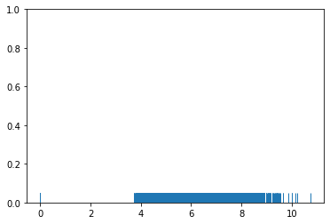
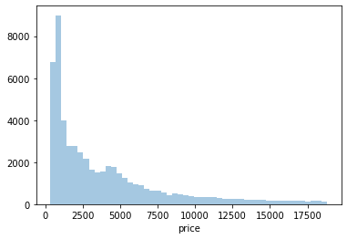
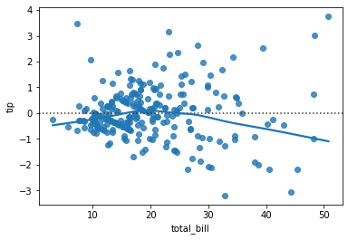

```python
import seaborn as sns
import numpy as np
import pandas as pd
```


```python
diam = pd.read_csv('https://raw.githubusercontent.com/mwaskom/seaborn-data/master/diamonds.csv')
```


```python
diam
```


<div>
<style scoped>
    .dataframe tbody tr th:only-of-type {
        vertical-align: middle;
    }

    .dataframe tbody tr th {
        vertical-align: top;
    }

    .dataframe thead th {
        text-align: right;
    }
</style>
<table border="1" class="dataframe">
  <thead>
    <tr style="text-align: right;">
      <th></th>
      <th>carat</th>
      <th>cut</th>
      <th>color</th>
      <th>clarity</th>
      <th>depth</th>
      <th>table</th>
      <th>price</th>
      <th>x</th>
      <th>y</th>
      <th>z</th>
    </tr>
  </thead>
  <tbody>
    <tr>
      <th>0</th>
      <td>0.23</td>
      <td>Ideal</td>
      <td>E</td>
      <td>SI2</td>
      <td>61.5</td>
      <td>55.0</td>
      <td>326</td>
      <td>3.95</td>
      <td>3.98</td>
      <td>2.43</td>
    </tr>
    <tr>
      <th>1</th>
      <td>0.21</td>
      <td>Premium</td>
      <td>E</td>
      <td>SI1</td>
      <td>59.8</td>
      <td>61.0</td>
      <td>326</td>
      <td>3.89</td>
      <td>3.84</td>
      <td>2.31</td>
    </tr>
    <tr>
      <th>2</th>
      <td>0.23</td>
      <td>Good</td>
      <td>E</td>
      <td>VS1</td>
      <td>56.9</td>
      <td>65.0</td>
      <td>327</td>
      <td>4.05</td>
      <td>4.07</td>
      <td>2.31</td>
    </tr>
    <tr>
      <th>3</th>
      <td>0.29</td>
      <td>Premium</td>
      <td>I</td>
      <td>VS2</td>
      <td>62.4</td>
      <td>58.0</td>
      <td>334</td>
      <td>4.20</td>
      <td>4.23</td>
      <td>2.63</td>
    </tr>
    <tr>
      <th>4</th>
      <td>0.31</td>
      <td>Good</td>
      <td>J</td>
      <td>SI2</td>
      <td>63.3</td>
      <td>58.0</td>
      <td>335</td>
      <td>4.34</td>
      <td>4.35</td>
      <td>2.75</td>
    </tr>
    <tr>
      <th>5</th>
      <td>0.24</td>
      <td>Very Good</td>
      <td>J</td>
      <td>VVS2</td>
      <td>62.8</td>
      <td>57.0</td>
      <td>336</td>
      <td>3.94</td>
      <td>3.96</td>
      <td>2.48</td>
    </tr>
    <tr>
      <th>6</th>
      <td>0.24</td>
      <td>Very Good</td>
      <td>I</td>
      <td>VVS1</td>
      <td>62.3</td>
      <td>57.0</td>
      <td>336</td>
      <td>3.95</td>
      <td>3.98</td>
      <td>2.47</td>
    </tr>
    <tr>
      <th>7</th>
      <td>0.26</td>
      <td>Very Good</td>
      <td>H</td>
      <td>SI1</td>
      <td>61.9</td>
      <td>55.0</td>
      <td>337</td>
      <td>4.07</td>
      <td>4.11</td>
      <td>2.53</td>
    </tr>
    <tr>
      <th>8</th>
      <td>0.22</td>
      <td>Fair</td>
      <td>E</td>
      <td>VS2</td>
      <td>65.1</td>
      <td>61.0</td>
      <td>337</td>
      <td>3.87</td>
      <td>3.78</td>
      <td>2.49</td>
    </tr>
    <tr>
      <th>9</th>
      <td>0.23</td>
      <td>Very Good</td>
      <td>H</td>
      <td>VS1</td>
      <td>59.4</td>
      <td>61.0</td>
      <td>338</td>
      <td>4.00</td>
      <td>4.05</td>
      <td>2.39</td>
    </tr>
    <tr>
      <th>10</th>
      <td>0.30</td>
      <td>Good</td>
      <td>J</td>
      <td>SI1</td>
      <td>64.0</td>
      <td>55.0</td>
      <td>339</td>
      <td>4.25</td>
      <td>4.28</td>
      <td>2.73</td>
    </tr>
    <tr>
      <th>11</th>
      <td>0.23</td>
      <td>Ideal</td>
      <td>J</td>
      <td>VS1</td>
      <td>62.8</td>
      <td>56.0</td>
      <td>340</td>
      <td>3.93</td>
      <td>3.90</td>
      <td>2.46</td>
    </tr>
    <tr>
      <th>12</th>
      <td>0.22</td>
      <td>Premium</td>
      <td>F</td>
      <td>SI1</td>
      <td>60.4</td>
      <td>61.0</td>
      <td>342</td>
      <td>3.88</td>
      <td>3.84</td>
      <td>2.33</td>
    </tr>
    <tr>
      <th>13</th>
      <td>0.31</td>
      <td>Ideal</td>
      <td>J</td>
      <td>SI2</td>
      <td>62.2</td>
      <td>54.0</td>
      <td>344</td>
      <td>4.35</td>
      <td>4.37</td>
      <td>2.71</td>
    </tr>
    <tr>
      <th>14</th>
      <td>0.20</td>
      <td>Premium</td>
      <td>E</td>
      <td>SI2</td>
      <td>60.2</td>
      <td>62.0</td>
      <td>345</td>
      <td>3.79</td>
      <td>3.75</td>
      <td>2.27</td>
    </tr>
    <tr>
      <th>15</th>
      <td>0.32</td>
      <td>Premium</td>
      <td>E</td>
      <td>I1</td>
      <td>60.9</td>
      <td>58.0</td>
      <td>345</td>
      <td>4.38</td>
      <td>4.42</td>
      <td>2.68</td>
    </tr>
    <tr>
      <th>16</th>
      <td>0.30</td>
      <td>Ideal</td>
      <td>I</td>
      <td>SI2</td>
      <td>62.0</td>
      <td>54.0</td>
      <td>348</td>
      <td>4.31</td>
      <td>4.34</td>
      <td>2.68</td>
    </tr>
    <tr>
      <th>17</th>
      <td>0.30</td>
      <td>Good</td>
      <td>J</td>
      <td>SI1</td>
      <td>63.4</td>
      <td>54.0</td>
      <td>351</td>
      <td>4.23</td>
      <td>4.29</td>
      <td>2.70</td>
    </tr>
    <tr>
      <th>18</th>
      <td>0.30</td>
      <td>Good</td>
      <td>J</td>
      <td>SI1</td>
      <td>63.8</td>
      <td>56.0</td>
      <td>351</td>
      <td>4.23</td>
      <td>4.26</td>
      <td>2.71</td>
    </tr>
    <tr>
      <th>19</th>
      <td>0.30</td>
      <td>Very Good</td>
      <td>J</td>
      <td>SI1</td>
      <td>62.7</td>
      <td>59.0</td>
      <td>351</td>
      <td>4.21</td>
      <td>4.27</td>
      <td>2.66</td>
    </tr>
    <tr>
      <th>20</th>
      <td>0.30</td>
      <td>Good</td>
      <td>I</td>
      <td>SI2</td>
      <td>63.3</td>
      <td>56.0</td>
      <td>351</td>
      <td>4.26</td>
      <td>4.30</td>
      <td>2.71</td>
    </tr>
    <tr>
      <th>21</th>
      <td>0.23</td>
      <td>Very Good</td>
      <td>E</td>
      <td>VS2</td>
      <td>63.8</td>
      <td>55.0</td>
      <td>352</td>
      <td>3.85</td>
      <td>3.92</td>
      <td>2.48</td>
    </tr>
    <tr>
      <th>22</th>
      <td>0.23</td>
      <td>Very Good</td>
      <td>H</td>
      <td>VS1</td>
      <td>61.0</td>
      <td>57.0</td>
      <td>353</td>
      <td>3.94</td>
      <td>3.96</td>
      <td>2.41</td>
    </tr>
    <tr>
      <th>23</th>
      <td>0.31</td>
      <td>Very Good</td>
      <td>J</td>
      <td>SI1</td>
      <td>59.4</td>
      <td>62.0</td>
      <td>353</td>
      <td>4.39</td>
      <td>4.43</td>
      <td>2.62</td>
    </tr>
    <tr>
      <th>24</th>
      <td>0.31</td>
      <td>Very Good</td>
      <td>J</td>
      <td>SI1</td>
      <td>58.1</td>
      <td>62.0</td>
      <td>353</td>
      <td>4.44</td>
      <td>4.47</td>
      <td>2.59</td>
    </tr>
    <tr>
      <th>25</th>
      <td>0.23</td>
      <td>Very Good</td>
      <td>G</td>
      <td>VVS2</td>
      <td>60.4</td>
      <td>58.0</td>
      <td>354</td>
      <td>3.97</td>
      <td>4.01</td>
      <td>2.41</td>
    </tr>
    <tr>
      <th>26</th>
      <td>0.24</td>
      <td>Premium</td>
      <td>I</td>
      <td>VS1</td>
      <td>62.5</td>
      <td>57.0</td>
      <td>355</td>
      <td>3.97</td>
      <td>3.94</td>
      <td>2.47</td>
    </tr>
    <tr>
      <th>27</th>
      <td>0.30</td>
      <td>Very Good</td>
      <td>J</td>
      <td>VS2</td>
      <td>62.2</td>
      <td>57.0</td>
      <td>357</td>
      <td>4.28</td>
      <td>4.30</td>
      <td>2.67</td>
    </tr>
    <tr>
      <th>28</th>
      <td>0.23</td>
      <td>Very Good</td>
      <td>D</td>
      <td>VS2</td>
      <td>60.5</td>
      <td>61.0</td>
      <td>357</td>
      <td>3.96</td>
      <td>3.97</td>
      <td>2.40</td>
    </tr>
    <tr>
      <th>29</th>
      <td>0.23</td>
      <td>Very Good</td>
      <td>F</td>
      <td>VS1</td>
      <td>60.9</td>
      <td>57.0</td>
      <td>357</td>
      <td>3.96</td>
      <td>3.99</td>
      <td>2.42</td>
    </tr>
    <tr>
      <th>...</th>
      <td>...</td>
      <td>...</td>
      <td>...</td>
      <td>...</td>
      <td>...</td>
      <td>...</td>
      <td>...</td>
      <td>...</td>
      <td>...</td>
      <td>...</td>
    </tr>
    <tr>
      <th>53910</th>
      <td>0.70</td>
      <td>Premium</td>
      <td>E</td>
      <td>SI1</td>
      <td>60.5</td>
      <td>58.0</td>
      <td>2753</td>
      <td>5.74</td>
      <td>5.77</td>
      <td>3.48</td>
    </tr>
    <tr>
      <th>53911</th>
      <td>0.57</td>
      <td>Premium</td>
      <td>E</td>
      <td>IF</td>
      <td>59.8</td>
      <td>60.0</td>
      <td>2753</td>
      <td>5.43</td>
      <td>5.38</td>
      <td>3.23</td>
    </tr>
    <tr>
      <th>53912</th>
      <td>0.61</td>
      <td>Premium</td>
      <td>F</td>
      <td>VVS1</td>
      <td>61.8</td>
      <td>59.0</td>
      <td>2753</td>
      <td>5.48</td>
      <td>5.40</td>
      <td>3.36</td>
    </tr>
    <tr>
      <th>53913</th>
      <td>0.80</td>
      <td>Good</td>
      <td>G</td>
      <td>VS2</td>
      <td>64.2</td>
      <td>58.0</td>
      <td>2753</td>
      <td>5.84</td>
      <td>5.81</td>
      <td>3.74</td>
    </tr>
    <tr>
      <th>53914</th>
      <td>0.84</td>
      <td>Good</td>
      <td>I</td>
      <td>VS1</td>
      <td>63.7</td>
      <td>59.0</td>
      <td>2753</td>
      <td>5.94</td>
      <td>5.90</td>
      <td>3.77</td>
    </tr>
    <tr>
      <th>53915</th>
      <td>0.77</td>
      <td>Ideal</td>
      <td>E</td>
      <td>SI2</td>
      <td>62.1</td>
      <td>56.0</td>
      <td>2753</td>
      <td>5.84</td>
      <td>5.86</td>
      <td>3.63</td>
    </tr>
    <tr>
      <th>53916</th>
      <td>0.74</td>
      <td>Good</td>
      <td>D</td>
      <td>SI1</td>
      <td>63.1</td>
      <td>59.0</td>
      <td>2753</td>
      <td>5.71</td>
      <td>5.74</td>
      <td>3.61</td>
    </tr>
    <tr>
      <th>53917</th>
      <td>0.90</td>
      <td>Very Good</td>
      <td>J</td>
      <td>SI1</td>
      <td>63.2</td>
      <td>60.0</td>
      <td>2753</td>
      <td>6.12</td>
      <td>6.09</td>
      <td>3.86</td>
    </tr>
    <tr>
      <th>53918</th>
      <td>0.76</td>
      <td>Premium</td>
      <td>I</td>
      <td>VS1</td>
      <td>59.3</td>
      <td>62.0</td>
      <td>2753</td>
      <td>5.93</td>
      <td>5.85</td>
      <td>3.49</td>
    </tr>
    <tr>
      <th>53919</th>
      <td>0.76</td>
      <td>Ideal</td>
      <td>I</td>
      <td>VVS1</td>
      <td>62.2</td>
      <td>55.0</td>
      <td>2753</td>
      <td>5.89</td>
      <td>5.87</td>
      <td>3.66</td>
    </tr>
    <tr>
      <th>53920</th>
      <td>0.70</td>
      <td>Very Good</td>
      <td>E</td>
      <td>VS2</td>
      <td>62.4</td>
      <td>60.0</td>
      <td>2755</td>
      <td>5.57</td>
      <td>5.61</td>
      <td>3.49</td>
    </tr>
    <tr>
      <th>53921</th>
      <td>0.70</td>
      <td>Very Good</td>
      <td>E</td>
      <td>VS2</td>
      <td>62.8</td>
      <td>60.0</td>
      <td>2755</td>
      <td>5.59</td>
      <td>5.65</td>
      <td>3.53</td>
    </tr>
    <tr>
      <th>53922</th>
      <td>0.70</td>
      <td>Very Good</td>
      <td>D</td>
      <td>VS1</td>
      <td>63.1</td>
      <td>59.0</td>
      <td>2755</td>
      <td>5.67</td>
      <td>5.58</td>
      <td>3.55</td>
    </tr>
    <tr>
      <th>53923</th>
      <td>0.73</td>
      <td>Ideal</td>
      <td>I</td>
      <td>VS2</td>
      <td>61.3</td>
      <td>56.0</td>
      <td>2756</td>
      <td>5.80</td>
      <td>5.84</td>
      <td>3.57</td>
    </tr>
    <tr>
      <th>53924</th>
      <td>0.73</td>
      <td>Ideal</td>
      <td>I</td>
      <td>VS2</td>
      <td>61.6</td>
      <td>55.0</td>
      <td>2756</td>
      <td>5.82</td>
      <td>5.84</td>
      <td>3.59</td>
    </tr>
    <tr>
      <th>53925</th>
      <td>0.79</td>
      <td>Ideal</td>
      <td>I</td>
      <td>SI1</td>
      <td>61.6</td>
      <td>56.0</td>
      <td>2756</td>
      <td>5.95</td>
      <td>5.97</td>
      <td>3.67</td>
    </tr>
    <tr>
      <th>53926</th>
      <td>0.71</td>
      <td>Ideal</td>
      <td>E</td>
      <td>SI1</td>
      <td>61.9</td>
      <td>56.0</td>
      <td>2756</td>
      <td>5.71</td>
      <td>5.73</td>
      <td>3.54</td>
    </tr>
    <tr>
      <th>53927</th>
      <td>0.79</td>
      <td>Good</td>
      <td>F</td>
      <td>SI1</td>
      <td>58.1</td>
      <td>59.0</td>
      <td>2756</td>
      <td>6.06</td>
      <td>6.13</td>
      <td>3.54</td>
    </tr>
    <tr>
      <th>53928</th>
      <td>0.79</td>
      <td>Premium</td>
      <td>E</td>
      <td>SI2</td>
      <td>61.4</td>
      <td>58.0</td>
      <td>2756</td>
      <td>6.03</td>
      <td>5.96</td>
      <td>3.68</td>
    </tr>
    <tr>
      <th>53929</th>
      <td>0.71</td>
      <td>Ideal</td>
      <td>G</td>
      <td>VS1</td>
      <td>61.4</td>
      <td>56.0</td>
      <td>2756</td>
      <td>5.76</td>
      <td>5.73</td>
      <td>3.53</td>
    </tr>
    <tr>
      <th>53930</th>
      <td>0.71</td>
      <td>Premium</td>
      <td>E</td>
      <td>SI1</td>
      <td>60.5</td>
      <td>55.0</td>
      <td>2756</td>
      <td>5.79</td>
      <td>5.74</td>
      <td>3.49</td>
    </tr>
    <tr>
      <th>53931</th>
      <td>0.71</td>
      <td>Premium</td>
      <td>F</td>
      <td>SI1</td>
      <td>59.8</td>
      <td>62.0</td>
      <td>2756</td>
      <td>5.74</td>
      <td>5.73</td>
      <td>3.43</td>
    </tr>
    <tr>
      <th>53932</th>
      <td>0.70</td>
      <td>Very Good</td>
      <td>E</td>
      <td>VS2</td>
      <td>60.5</td>
      <td>59.0</td>
      <td>2757</td>
      <td>5.71</td>
      <td>5.76</td>
      <td>3.47</td>
    </tr>
    <tr>
      <th>53933</th>
      <td>0.70</td>
      <td>Very Good</td>
      <td>E</td>
      <td>VS2</td>
      <td>61.2</td>
      <td>59.0</td>
      <td>2757</td>
      <td>5.69</td>
      <td>5.72</td>
      <td>3.49</td>
    </tr>
    <tr>
      <th>53934</th>
      <td>0.72</td>
      <td>Premium</td>
      <td>D</td>
      <td>SI1</td>
      <td>62.7</td>
      <td>59.0</td>
      <td>2757</td>
      <td>5.69</td>
      <td>5.73</td>
      <td>3.58</td>
    </tr>
    <tr>
      <th>53935</th>
      <td>0.72</td>
      <td>Ideal</td>
      <td>D</td>
      <td>SI1</td>
      <td>60.8</td>
      <td>57.0</td>
      <td>2757</td>
      <td>5.75</td>
      <td>5.76</td>
      <td>3.50</td>
    </tr>
    <tr>
      <th>53936</th>
      <td>0.72</td>
      <td>Good</td>
      <td>D</td>
      <td>SI1</td>
      <td>63.1</td>
      <td>55.0</td>
      <td>2757</td>
      <td>5.69</td>
      <td>5.75</td>
      <td>3.61</td>
    </tr>
    <tr>
      <th>53937</th>
      <td>0.70</td>
      <td>Very Good</td>
      <td>D</td>
      <td>SI1</td>
      <td>62.8</td>
      <td>60.0</td>
      <td>2757</td>
      <td>5.66</td>
      <td>5.68</td>
      <td>3.56</td>
    </tr>
    <tr>
      <th>53938</th>
      <td>0.86</td>
      <td>Premium</td>
      <td>H</td>
      <td>SI2</td>
      <td>61.0</td>
      <td>58.0</td>
      <td>2757</td>
      <td>6.15</td>
      <td>6.12</td>
      <td>3.74</td>
    </tr>
    <tr>
      <th>53939</th>
      <td>0.75</td>
      <td>Ideal</td>
      <td>D</td>
      <td>SI2</td>
      <td>62.2</td>
      <td>55.0</td>
      <td>2757</td>
      <td>5.83</td>
      <td>5.87</td>
      <td>3.64</td>
    </tr>
  </tbody>
</table>
<p>53940 rows × 10 columns</p>
</div>


```python
sns.distplot(diamond['price'])
```


    <matplotlib.axes._subplots.AxesSubplot at 0x7f9a01e9d150>





```python
sns.distplot(diamond['price'], kde = False)
```


    <matplotlib.axes._subplots.AxesSubplot at 0x7f99f6d14690>





```python
sns.rugplot(diamond['x'])
```


    <matplotlib.axes._subplots.AxesSubplot at 0x7f9a00258890>


```python
sns.kdeplot(diamond['price'])
```


    <matplotlib.axes._subplots.AxesSubplot at 0x7f99f6d9f850>





```python

```
